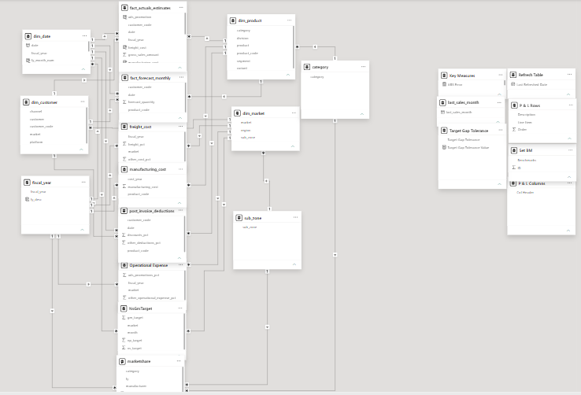

# Business Insights 360 | Power BI Project

## Overview

Business Insights 360 is an end-to-end Business Intelligence solution developed for AtliQ Hardware, a global consumer electronics company operating across multiple markets and business functions.

The objective of this project was to transform raw business data into meaningful insights and enable data-driven decision-making across Sales, Finance, Marketing, Supply Chain, and Executive Management teams.

---

## Business Problem

AtliQ Hardware was experiencing rapid business growth but faced challenges in analyzing large volumes of business data using traditional Excel-based reporting systems. As data complexity increased, limitations in scalability, reporting efficiency, and decision-making became significant obstacles.

To overcome these challenges, an advanced analytics solution was required to provide a centralized view of business performance and support strategic decision-making across departments.

---

## Objective

To develop a comprehensive Power BI dashboard that delivers actionable insights for business leaders across multiple domains, including:

* Sales
* Finance
* Marketing
* Supply Chain
* Executive Management

---

## Tools & Technologies Used

* Power BI
* Power Query
* DAX
* SQL
* Excel
* Snowflake Schema

---

## Dataset Overview

The project utilizes data from multiple business domains, including customers, products, sales transactions, forecasts, pricing, and operational costs.

### Dimension Tables

#### Customer Data

* 75 customers across 27 global markets
* Channels: Retailer, Direct, Distributor
* Platforms: Brick & Mortar, E-Commerce

#### Market Data

* 27 markets
* 7 sub-zones
* 4 regions: APAC, EU, LATAM, NA

#### Product Data

* P & A (Peripherals & Accessories)
* PC (Notebook & Desktop)
* N & S (Networking & Storage)
* 14 product categories
* Multiple product variants

### Fact Tables

#### Sales Data

Contains monthly customer sales transactions and product-level sales performance.

#### Forecast Data

Contains monthly demand forecasts used for inventory planning and forecasting accuracy analysis.

### Supporting Tables

* Gross Price
* Manufacturing Cost
* Freight Cost
* Pre-Invoice Deductions
* Post-Invoice Deductions

---

## Data Model

This project follows a Snowflake Schema approach to efficiently manage relationships between fact and dimension tables.

The data model integrates sales, forecasting, pricing, manufacturing costs, freight costs, and deduction-related datasets to provide a unified business view across departments.

### Data Model Diagram

---

## Dashboard Views

### Sales View

* Customer performance analysis
* Product performance analysis
* Net Sales tracking
* Gross Margin analysis
* Profitability monitoring

#### Sales Dashboard

.png)

---

### Finance View

* Profit & Loss Statement
* Top and Bottom performing products
* Top and Bottom performing customers
* Financial performance analysis across markets

#### Finance Dashboard

.png)

---

### Marketing View

* Regional and market performance analysis
* Category and segment profitability
* Gross Margin and Net Sales evaluation

#### Marketing Dashboard

.png)

---

### Supply Chain View

* Forecast Accuracy tracking
* Net Error analysis
* ABS Error monitoring
* Customer and product forecasting performance

#### Supply Chain Dashboard

.png)

---

### Executive View

* High-level KPI monitoring
* Market Share analysis
* Gross Margin trends
* Net Profit trends
* Department-wise performance overview

#### Executive Dashboard

.png)

---

## Key KPIs

* Net Sales
* Gross Margin (GM)
* Gross Margin %
* Net Profit
* Net Profit %
* Forecast Accuracy %
* Net Error %
* ABS Error
* Market Share %

---

## Key Insights

* Enabled centralized reporting across multiple business functions.
* Improved visibility into customer, product, and market performance.
* Identified top-performing and underperforming products, customers, and regions.
* Enhanced forecasting visibility through supply chain analytics.
* Supported business leaders with data-driven decision-making.

---

## Project Outcome

The dashboard provides a 360-degree view of business performance and enables stakeholders to monitor critical KPIs through an interactive reporting environment.

The solution helps bridge the gap between data and decision-making by delivering actionable insights across Sales, Finance, Marketing, Supply Chain, and Executive functions.

---

## My Contributions

* Built the Power BI data model
* Developed DAX measures and KPIs
* Created interactive dashboards and reports
* Implemented drill-through and dynamic filtering
* Designed business-focused visualizations
* Performed data transformation using Power Query
* Delivered insights for multiple business departments

---

## Live Dashboard

🔗 View Interactive Power BI Dashboard:
https://app.powerbi.com/view?r=eyJrIjoiN2VhNTBkZmQtYzc0ZC00OGRiLThlNDMtZWNkYzg1OWIzMDE5IiwidCI6ImM2ZTU0OWIzLTVmNDUtNDAzMi1hYWU5LWQ0MjQ0ZGM1YjJjNCJ9

---

## Note

This project demonstrates my ability to build an end-to-end Business Intelligence solution, including data modeling, KPI development, DAX calculations, dashboard design, and business performance analysis.

